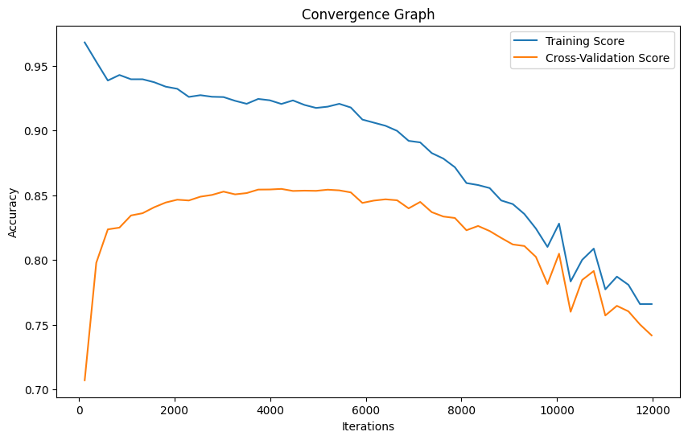

# PARAMETER_opt

## About SVM and Parameter Optimization
Support Vector Machine or SVM is one of the most popular Supervised Learning algorithms, which is used for Classification as well as Regression problems. However, primarily, it is used for Classification problems in Machine Learning.

Some of the most important parameters of SVM such as kernel, C, and gamma can be changed in order to achieve a higher accuracy. This is called as Hyperparameter Tuning.

We can perform this task using GridSearchCV for optimizing these parameters.

In this python file, I've used a Fitness Function to optimize the parameters.

## Dataset

The data are MC generated (see below) to simulate registration of high energy gamma particles in a ground-based atmospheric Cherenkov gamma telescope using the imaging technique. Cherenkov gamma telescope observes high energy gamma rays, taking advantage of the radiation emitted by charged particles produced inside the electromagnetic showers initiated by the gammas, and developing in the atmosphere. This Cherenkov radiation (of visible to UV wavelengths) leaks through the atmosphere and gets recorded in the detector, allowing reconstruction of the shower parameters. The available information consists of pulses left by the incoming Cherenkov photons on the photomultiplier tubes, arranged in a plane, the camera. Depending on the energy of the primary gamma, a total of few hundreds to some 10000 Cherenkov photons get collected, in patterns (called the shower image), allowing to discriminate statistically those caused by primary gammas (signal) from the images of hadronic showers initiated by cosmic rays in the upper atmosphere (background)

## Final Result Table

| Sample | Best Accuracy | Best Kernel | Best Nu | Best Epsilon |
| ------ | ------------ | -----------| ------- | ------------ |
| 1      | 0.65         | rbf        | 9.91    | 2.85         |
| 2      | 0.63         | rbf        | 6.05    | 5.05         |
| 3      | 0.65         | rbf        | 0.66    | 7.24         |
| 4      | 0.69         | rbf        | 5.34    | 0.94         |
| 5      | 0.62         | rbf        | 9.03    | 4.84         |
| 6      | 0.69         | sigmoid   | 2.23    | 6.82         |
| 7      | 0.72         | rbf        | 3.43    | 0.46         |
| 8      | 0.66         | rbf        | 0.73    | 7.82         |
| 9      | 0.68         | sigmoid   | 8.14    | 7.48         |
| 10     | 0.69         | rbf        | 1.69    | 2.31         |

## Convergence Graph

